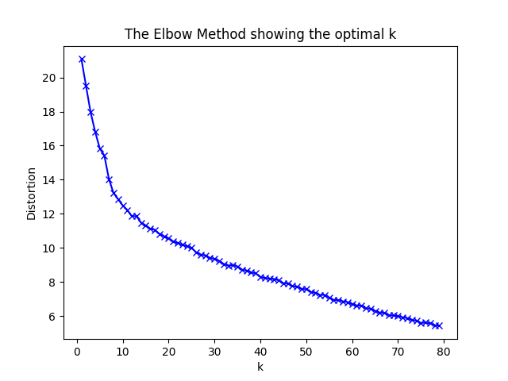
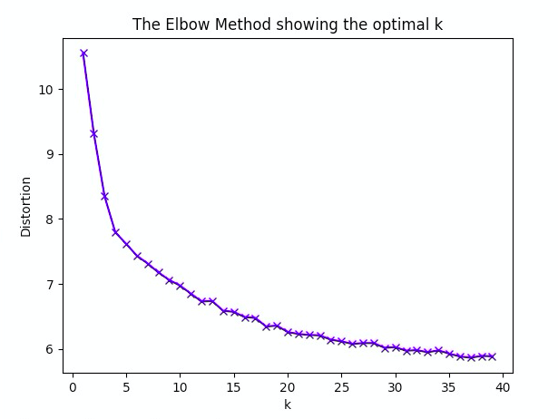
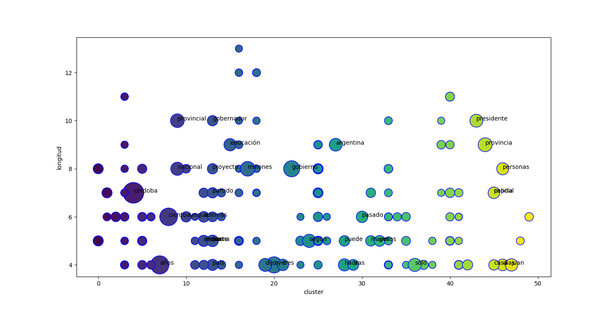
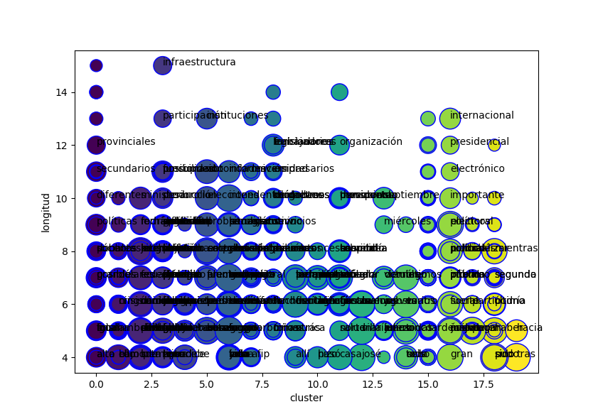

# Clustering con embeddings

## Introducción
En este proyecto se intenta aplicar la técnica de aprendizaje no supervisado 
denominada clustering sobre un corpus de noticias de La Voz del Interior, medio
gráfico Cordobés.
Se utilizarán tambien técnicas de normalizacion, manipulación de features y 
vectorización de estas palabras para luego aplicar clustering.
Como resultado no se espera tener algo significativo debido a que un corpus de 
noticias no es algo especifico de un nicho de palabras. Es decir al tener tanta
variedad en las palabras, es posible que tengamos que conformarnos con algunos 
clusters bien identificados, quizás las palabras que mas se mencionen dentro 
del texto. Además utilizaremos variaciones en los features seleccionados para 
vectorizar, y hasta se incorporarán word-embeddings tales word2vec o triplas de
dependencia, para obtener quizás mejores resultados.
El trabajo se desarrollará integramente en python.

## Las librerias que utilizaremos..
### requirements.txt
* ipython
* nltk
* sklearn
* numpy
* scipy
* gensim
* matplotlib

```python
from nltk.tokenize import RegexpTokenizer, word_tokenize, sent_tokenize
'''
Para separar las oraciones del texto y posteriormente separar las palabras.
RegexpTokenazer puede ser utilizado para evitar algunas palabras inutiles para 
el procesamiento.
No lo utilizamos porque creemos que eran importantes para un contexto, recien 
fueron retiradas en el proceso de vectorizacion.
'''
from nltk.corpus import stopwords
from nltk import pos_tag #Bad results
from nltk.tag.stanford import StanfordPOSTagger as StTagger
'''
Sobre NLTK utilizamos las stopwords 'spanish' para retirarlas del analisis,
también probamos su POS tagger nativo pero no obtuvimos buenos resultados sobre
el español. Por eso decidimos incorporar StanfordPOSTAgger que corre sobre un 
backend de JAVA externo pero esta libreria nos facilita este vinculo.
'''
from gensim.models import KeyedVectors
'''
Gensim fue necesario para realizar word2vec. Word2Vec esta deprecada, su update 
es KeyedVectors. Con el importamos un modelo ya entrenado del español.
'''
# from nltk.probability import FreqDist
'''
Para retirar las palabras poco frecuentes
'''
from sklearn.feature_extraction.text import CountVectorizer
from sklearn.feature_extraction import DictVectorizer
from sklearn.cluster import KMeans
'''
SKLEARN fue utilizado tanto para la tarea propia de clustering con KMeans como 
asi tambien para vectorizar las palabras con sus caracteristicas.
CountVectorizer no fue utilizado porque se prefiriò hacer algo mas "casero" 
para profundizar los conceptos.
'''

from string import punctuation
import numpy as np
import pprint
from collections import defaultdict
'''
Librerias utiles para tratar problemas cotidianos de estructuras de datos.
'''
```
## Herramientas a utilizar/desarrollar
* *Cleaner* o normalizador de texto: Eliminará las palabras poco frecuentes y 
'basura' dentro del texto.
* *Featurizer*: Se encargará de disponibilizar las caracteristicas de las 
palabras al vectorizer
* *Vectorizer*: Hará de cada palabra un vector numerico que describa la palabra
representada mediante sus caracteristicas.
* *Clusterizer*: Separará las palabras de acuerdo a la similitud de vectores.

## Uso de binarios externos.
Antes de empezar definiremos algunos modelos públicos utilizados en el desarrollo del trabajo.
Para el caso de POS tag en palabras decidimos inicialmente usar NLTK, pero no descartamos otras alternativas ya que en español
no es tan recomendable.
Como alternativa entonces decidimos probar tambien el [POS tagger de Stanford](https://nlp.stanford.edu/software/tagger.shtml) y comparar resultados. En este caso python
solo ofrece una libreria para integrar un jar y un modelo de Stanford. Definiremos entonces estas constantes:
```python
MODEL_SFD_TAGGER = 'stanford-postagger-full-2017-06-09/models/spanish.tagger'
JAR_SFD_TAGGER = 'stanford-postagger-full-2017-06-09/stanford-postagger.jar'
```
Para el caso de word2vec también integramos un [modelo preentrenado](http://crscardellino.me/SBWCE/) de Cristian Cardellino, aunque en las pruebas
preeliminares utilizamos uno de GoogleNews aunque con muy malos resultados.
```python
#TRAINED_MODEL_V2VEC = 'GoogleNews-vectors-negative300.bin'
TRAINED_MODEL_V2VEC = 'SBW-vectors-300-min5.bin'
```

## Estructura del código
### Funciones auxiliares.
Para el etiquetado de POS
```python
def _pos_tag(file, tagger='stanford'):
```
Para preprocesamiento de cada oración
```python
def _clean_sentence(sentence):
```
Para obtener el vector de W2V para cada palabra
```python
def _word_to_vec(word):
```

### Pipeline
En la instancia de preprocesamiento del texto, retiramos tanto las palabras
pertenecientes al conjunto de *stopwords* de NLTK para el idioma Español, como
asi también los signos de puntuación. En cuanto a los números del corpus, se 
efectúo la traducción de todos ellos a una unica palabra *NUMBER*. Todas las
palabras fueron tokenizadas en su forma minúscula, esta última transformación
nos permitirá reducir la cantidad de palabras aisladas que generan clustering
del tipo singleton. 

Luego de la normalización de la oración se procede a la caracterización de las
palabras mediante el proceso de featurize. Aquí son anotadas las diversas
cualidades en un diccionario que luego será vectorizado.
```python
def featurize(tagged_sentences, with_w2vec=True):
```
Una vez que caracterizamos cada palabra con sus cualidades la vectorizaremos 
automaticamente gracias a [DictVectorizer](http://scikit-learn.org/stable/modules/generated/sklearn.feature_extraction.DictVectorizer.html).
```python
def vectorize(featurized_words):
```
Por ultimo con la matriz de vectores, solo nos queda agrupar mediante un proceso
de clustering donde mediante la configuracion de la cantidad de centroides el
algoritmo iterará hasta converger en una asignación significativa de las palabras
vectorizadas. 
```python
def cluster(vectorized_words, word_index):
```
Etiquetados dichos vectores con el numero de cluster al cual pertenecen,
será solo tarea de integrar esa informacion a los datos de las palabras y mostrar
una visualizacion humanizada.
```python
def preety_print_cluster(kmeans, refs, only_id=None):
```
En una ultima iteración este pipeline se verá modificado por la normalizacion y reducción
de dimensionalidad, pero se decidió no entrar en detalle ya que se explicará en la próxima
entrega.

## Herramienta de clustering utilizada
Para efectuar la tarea de clustering, utilizamos la herramienta de sklearn 
[KMeans](http://scikit-learn.org/stable/modules/generated/sklearn.cluster.KMeans.html).
En una primer etapa lo utilizamos con los valores por defecto y obtuvimos una 
buena relación costo computacional / resultado. En una segunda iteración se
configuró con las siguientes modificaciones en los parámetros.

* *n_clusters=30*: fijamos el numero de clusters igual que en la anterior 
iteración.
* *init="k-means++"*: seleccion de centros para K-means de manera inteligente
para facilitar la convergencia.
* *n_init=20* : aumentamos al doble el numero de veces que inicia el algoritmo
con diferentes centroides.
* *max_iter=500* : duplicamos también el valor por defecto de máximas iteraciones
en caso de no lograr la convergencia.
* *verbose=True* : simplemente para ver el flujo.
* *n_jobs=-1* : uso de todo el poder de computo.

Los resultados no fueron tan distintos a lo computado con los valores por 
defecto pero el tiempo de ejecución fue notablemente mas alto.


## Preguntas frecuentes
* ¿Cuántos clusters es lo optimo para mi corpus?
En cuanto a esta pregunta la respondimos mediante el uso del cálculo de la 
distorsion entre los clusters. Obtuvimos algunas diferencias interesantes entre
la distorsion generada con el tagger de NLTK y el de Stanford. Esto representa
que el POS tag aporta mucha información, es un feature muy relevante en el 
proceso.
* Con **NLTK** tagger:



* Con **Stanford** tagger:



* *¿Cómo realizar un gráfico de los clusters?*

A la hora de graficar el cluster no pudimos encontrar una forma interesante de
ver los datos. Optamos por crear 2 dimensiones que nos parecieran relevantes,
tales como la longitud de la palabra y el cluster donde se ubican para graficarlas
en el plano. La dimension del punto será la referencia a la cantidad de menciones
en el texto y a aquellas palabras que tengan gran volumen de menciones colocarles
su nombre para saber de cuales se trata. Cabe aclarar que las caracteristicas
que se grafiquen en el plano puede que no sean relevantes pero en el caso de
palabras aisladas es dificil obtener una característica de evaluación importante.

* *¿Hacer la normalización del texto antes o despues de efectuar la 
featurización?*

En este trabajo la normalización se hizo en varias etapas. La tokenizacion retiró
las stopwords , puntuación y simbolos extraños. Por su parte la vectorizacion,
descartó las palabras poco frecuentes y también las palabras de muy corta longitud
como asi tambien los numeros, ya que suelen ser irrelevantes y posiblemente 
queden aisladas por la repetición muy baja o muy alta. Se tomó esta decisión ya
que se considero el contexto relevante en muchos casos mas allá que se retire
como palabra a analizar. También cabe aclarar que de esta forma, se requieren
menos iteraciones sobre el texto, ya que la normalizacion esta acompañada con
otra tarea en el mismo ciclo d ejecución.


## Observaciones
* Hemos notado una gran mejora utilizando Stanford POS tagger en contraoposicion
a NLTK pero a un costo elevado a cuanto tiempo de ejecución.

* Remover las palabras cortas mejora muchisimo la clusterizacion ya que por mas 
que no sean stopwords pueden ocurrir con mucha frecuencia y en entornos muy 
aislados.

* Como ya habiamos mencionado en la introducción, al no ser un texto especifico
de algún área, la clusterizacion puede caer muchas veces en agrupamientos tipo
singletones, donde una palabra puede ser un cluster debido a que tiene 
características muy diferentes al resto. Esto no nos beneficia ya que perdemos 
un cluster solo para dicha palabra.

* No notamos grandes mejoras en cuanto al uso de word-embeddings aunque 
parecen útiles para otras tareas.

* En cuanto a la ventana de contexto, con una ampliación de contexto de 1 a 2
palabras para cada dirección hemos visto una mejora significativa a la hora de
hacer los clusters, pero las palabras conflictivas seguirían difernciandose más
aún.

* Una observación interesante fue que al realizar el mismo experimento sobre un
corpus de 1000 notas (3 veces más), fue bastante mejor la agrupación de 
palabras. Es algo esperable ya que mientras mas palabras haya, mas contextos
habrá y mas similitudes de contexto existirán entre las palabras. Dicho output
se puede visualizar en [output/1000notas.txt](output/1000notas.txt)

* El número de features también crece junto con la cantidad de notas que 
incorporamos a la prueba, y obtuvimos mas de 30000 sin aplicar feature 
selection mas que la eliminación de aquellos con varianza nula por parte del 
DictVectorizer.

## Resultados
En general los resultados fueron relativos a lo que se esperaba, con un corpus
tan variado en cuanto a vocabulario, con un contexto tan variable como las 
noticias, a pesar de la eliminación de palabras poco frecuentes, se vieron
muchos clusters de tipo singleton. Esto es debido a una diferencia notable 
entre esta palabra y el resto del corpus.

Sin embargo aquellos clusters que supieron agrupar un volumen considerable de
palabras lo hicieron de manera esperable. Con algún criterio en común algunos
clusters agruparon por semantica donde se pueden distinguir conceptos como:
* Temporalidad (Septiembre, Octubre, pasó, hacia, miércoles)
* Localidad (provincial, nacional)
* Posicionalidad (primer, primera, ultimos)
* Números (tres, cuatro, ocho, cinco)
* Conceptos civiles (pais, partido, presidente, gobernador)


### Stanford:
Aqui vemos que se obtuvieron algunos clusters interesantes sobre el corpus de 
300 notas como el caso del n8 donde se agruparon algunas palabras como "inflacion",
"conflicto" ,"momento", "sociedad"  y demás, aunque obviamente también aparecen
palabras poco relacionadas como "hombre" o "mujer" que pueden estar relacionadas
entre si aunque no con la "inflación" por ejemplo.

Por otro lado vemos clusters como el n14 donde se asociaron solo 2 palabras que
suelen tener muchos contextos iguales. "nacional" y "provincial" son dos palabras
correctamente asociadas ya que son muy similares en su uso. De igual forma el
n22 asociando solo numeros escritos con palabras

Otra situación interesante a notar es que muchos de los clusters como el n0 o
el n2 son singletones que no pudieron encontrar otro ejemplar con similitudes
en el resto del corpus. Esto puede atribuirse a una mala o escasa normalización
de texto, es decir falta limpiar todavia mas palabras irrelevantes, como asi 
también a un corpus muy variado en cuanto a vocabulario.
[Ver clusters](output/300notas.txt)

## Cambiando de tagger..NLTK.
Aqui vemos una mayor dispersión de la información, donde no se distinguen muchos
buenos ejemplos de clusters bien asociados.

Decidimos aplicar una clusterizacion mas grande debido a que la distorsión con
este método nos dió mucha mas alta que con Stanford Tagger.

A favor del tagger NLTK es casi instantanteo mientras que el de Stanford 
tarda un tiempo considerable. Por eso como recomendación seria utilizar para hacer
pruebas preliminares el NLTK y luego hacer una pureba final con un tagger más
adecuado.
[Ver clusters](output/300notasNLTK.txt)

## Un ultimo intento.. veamos que pasa aplicando normalizacion y reducción de dimensionalidad.
En esta ultima iteración decidimos aplicar algunas técnicas que se desarrollarán especificamente
en el siguiente experimento, pero anticipandonos logramos ver una diferencia relevante en los
resultados. Los clusters se hicieron mas densos y mas interesantes en su clasificación.
Además se incluyó el POS tag de Spacy que aceleró el proceso sin perder calidad,
obteniendo un resultado similar al de Stanford. También se incluyó las dependencia en cada palabra
como un feature más. Los clusters son ahora mas significativos y numerosos en cuanto a cardinalidad.
[Ver clusters](output/600notasSpacy.txt)

## Mas clusters
[2000 notas 40 clusters](output/2000notas_spacy_40clusters.txt)

[2000 notas 80 clusters](output/2000notas_spacy_80clusters.txt)

## Imagen clustering


